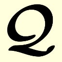

# Quantwo  <br/><br/>

The program transforms an operator expression into an expression in terms of integrals and amplitudes.

## Complilation

The program can be compiled using the following commands:

```bash
tar -xvf quantwo.tgz
cd quantwo
make
```

It generates an executable `quantwo`

### make commands

* `make` : compiles the program
* `make clean` : removes all object files and executables
* `make veryclean` : removes all object files, executables, `*.pdf`, `*.aux`, `*.dvi`, `*.ps`, `*.log`, `*~`
* `make equation` : generates `equation.pdf` from `input.q2`
* `make depend` : analyzes dependencies in src
* `make base` : creates working environment (see the next paragraph)

Rational numbers can be used instead of double precision numbers by activating the following line in `Makefile`

```bash
CFLAGS := $(CFLAGS) -D _RATIONAL
```

## Execution

To run the program:
  
```bash
quantwo <input-file> [<output-file>]
```

If no `<output-file>` is given, the output will be written to `<input-file without extension>.tex`.

The output file can be transformed to PDF using latex:

```bash
pdflatex equation.tex
```

NOTE: the output filename has to be `input.tex` or should be changed in file `equation.tex`.
The equation of course can also be copied to some external `tex` file. The definitions can be found in `definitions.tex`.

You can create a working environment by creating a symbolic link to the Makefile and running `make base`:

```bash
mkdir PATH_TO_DIR/WORKING_DIR
cd PATH_TO_DIR/WORKING_DIR
ln -s PATH_TO_Q2_DIR/Makefile .
make base
```

It creates symbolic links to all needed files from `quantwo` directory. 

With `make equation` you can then create `equation.pdf` from `input.q2`-file.

With `make equation out=<filename>` you can create `<filename>.pdf` from `input.q2`-file.

With `make equation in=<filename>` you can create `equation.pdf` from `<filename>.q2`-file.

### Command-line parameters

```bash
--help (-h) print help message
--verbose [level] (-v [level]) be chatty - print more 
```

## Options

Various options can be changed in a config file `params.reg` (including a definition of simple new commands (`set="newcommand"`))

### Changing options in input

One can change options in input-file using 
```bash
<set>,<name>=<value>[,<name>=<value>[,...]]
```

e.g., 

```bash
syntax,beq="\beqa",eeq="\eeqa" 
```

## Input file

The input file has a `Latex` form.

The equation has to be surrounded by `\begin{equation}` (or `\beq`) and `\end{equation}` (or `\eeq`) (`syntax:beq,eeq`).

To insert a comment use `%` (`syntax:comment`).

At this stage the following mathematical operators and latex commands are recognized:
```latex
(, [, ), ], {, }, +, -, <number>, \frac{<number>}{<number>}, \half, < <bra> |, | <ket> >, \op <operator>, \mu_<integer>,
\dagger, \dg, \tnsr <tensor>, \sum_{<excitation>[,<excitation>[,...]]}, \newcommand{}{}, \Perm{<from>}{<to>} 
```

Following latex commands will be ignored:

```latex
\left, \right, \lk, \rk, &, \\ (syntax:skipop)
```

All not recognized symbols will be ignored and a warning will be written.

### newcommand

A simple version of `\newcommand` is implemented, which can be used from input file (one per line):
  
```latex
\newcommand{}{}
```

e.g.,  

```latex
% replace all \U by (\op T_1 + \op T_2)
\newcommand{\U}{(\op T_1 + \op T_2)} 
```

### newoperator

With `\newoperator` (or `\newop`) command one can define custom operators: 

```latex
\newop{}{}
```

e.g.,  

```latex
% Hamiltonian
\newop{H}{\op F + \op W}
% T operator for CCSD
\newop{T}{\op T_1 + \op T_2} 
```

### operators

1) Parts of Hamiltonian: `\op H`, `\op F`, `\op W` and `\op X` (1-electron perturbation) (`hamilton:fock` `hamilton:flucpot` `hamilton:perturbation`).
2) Bare excitation operators: `\op \tau_{<excitation>}` (`syntax:bexcop`), where `<excitation>` can be, e.g., `\mu_1`, `\nu_3`, `\mu_2^{-1}` (non-conserving), etc. (`syntax:excitation`).
3) Cluster operators and intermediates: `\op <name of operator>_<excitation class>^<addition to name and/or \dagger>`, e.g., `\op T_2`, `\op U_3`, `\op S_4^{X}`, `\op Z^{bla}_1`
     * `<name of operator>` must not match name of a part of Hamiltonian (see point 1)!
     * Deexcitation operators have to be marked with `^\dagger` (or `^\dg`), e.g., `\op T_2^\dg`, `\op T_4^{X\dagger}`.
4) Non-conserving operators: `\op <name of operator>_<excitation class>^<addition to name and/or \dagger and change in particle number>`, e.g., `\op T_2^{+1}` (2 occ.orbs and 3 virt.orbs), `\op T_1^{-1}` (1 occ.orbs and 0 virt. orbs).
5) (De)Excitation operators with explicitly given types of orbitals:        `\op <name of operator>_<excitation class_<orbitals to annihilate>^<orbitals to create>>^<addition to name and/or \dagger>`, e.g., `\op T_{2_{ii}^{aa}}` (usual excitation operator), `\op T_{2_{iu}^{ua}}` (annihilate electrons in closed-shell and active space and create in active and virtual space).

### bra/ket

bra and ket can be  
1) reference state: `0`, `\Phi_0` or `HF` (all have the same meaning) (`syntax:ref`),
2) excited determinant: `<excitation>` (like in excitation operators ), e.g., `\mu_1`, `\nu_3`, etc,
3) contravariant excited determinant: `\bracs`, `\bracd`, `bract` for single, double and triple (quasi-contravariant), respectively,
4) explicitly given excited determinant: `\Phi^<set of indices>_<set of indices>`, e.g. `\Phi^{aa_1}_{ii_{1}}`, `\Phi^{ab}_{ij}`, etc (`syntax:csf`).

### tensors

1) Tensor with excitation indices: `\tnsr <name of tensor>_<excitation>^<addition to name>` (`command:tensor`)
    e.g., `\tnsr \Lambda_{\mu_2}`.<br>
  `<excitation>` should match one of `<excitation>`s in [bare excitation operators](#operators) or [excited determinant](#braket).
2) Number: `\tnsr <name of tensor>^<addition to name>` , e.g., `\tnsr \omega^X`.

### sum

Sum over excitations:

```latex
\sum_{<excitation>[,<excitation>[,...]]} 
```

e.g., `\sum_{\mu_2}`.

`<excitation>` should match one of `<excitation>`s in [bare excitation operators](#operators) or [excited determinant](#braket).
  
### connections

Connection (disconnection) of an expression can be set using `_C` (`_D`).
E.g.,  

```latex
(\op T_2^\dg \op W \op T_2 \op T_1)_C 
```

means that the whole expression has to be connected.

```latex
(\op T_2^\dg \op W \op T_2 \op T_1)_D 
```

means that a part of the equation has to be disconnected.
The following equality applies:

```latex
(...) = (...)_C + (...)_D
```

If connection sign is written after ket (`|...>_C`), the expression inside of bra/ket has to be connected (as in usual Coupled Cluster).

### no normal ordering

To switch off the normal ordering set `prog,wick=2,noorder=2`

`noorder=1`: only Hamiltonian is not ordered.

In order to replace `h_{pq}` in the final expressions by `f_{pq}` set `prog,usefock=1`.

### multireference

In order to produce internally contracted expressions with active orbitals set `prog,multiref=1`.

Contracted excitation operators can be activated by setting `prog,contrexcop=1` (default now).

### Examples

Energy expression:

```latex
\beq
<0|\op W (\op T_2+\frac{1}{2}\op T_1 \op T_1) |0>
\eeq
```

LCCD amplitude equation:

```latex
\beq
<\mu_2|(\op F + \op W) (1+\op T_2) |0>_C
\eeq
```

MP2 Lagrangian:

```latex
\beq
<0|\op W \op T_2 |0> + \sum_{\mu_2} \tnsr \Lambda_{\mu_2} <\mu_2|\op W +\op F \op T_2 |0>_C
\eeq
```

## Output file

By default, closed-shell expressions in spatial orbitals are generated.

* Occupied indices: `ijklmno` (`syntax:occorb`)
* Virtual indices: `abcdefgh` (`syntax:virorb`)
* General indices: `pqrs` (`syntax:genorb`)
* Active indices: `tuvwxyz` (`syntax:actorb`)

For explicit-spin orbitals, lowercase letters are used for alpha-spin orbitals and uppercase letters for beta-spin orbitals.

4-index integrals are written in the chemical notation: `(ai|bj)` using `\tnsr \intg` command (`command:integral`).
Indices of amplitudes are written as superscript (for annihilators) and subscript (for creators): `\tnsr T^{ij}_{ab}`.
Amplitudes coming from deexcitation operators have superscript and subscript indices swapped, e.g.
`\tnsr T^{\snam{\dg}ab}_{ij}`.

## Permutations

```latex
\Perm{<from>}{<to>}
```

Indices in the expression have to be permuted, the first set of indices is "from", the second is "to", e.g.,

```latex
\Perm{ijk}{jki} T^{ijk}_{abc} => T^{jki}_{abc}
```

It is possible to divide all expressions by the sum of permutations using 

```latex
act,divide=$(<sum of permutations>)$
```

e.g., in order to derive spin-summed perturbative triples equations:
  
```latex
act,divide=$(1 - \Perm{abc}{cab})$
\beq
\bract \op H (\op T_2 ) |0>_C
\eeq
```
